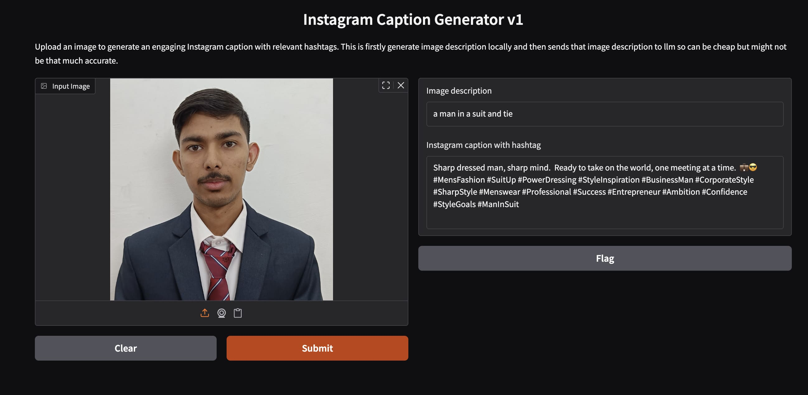
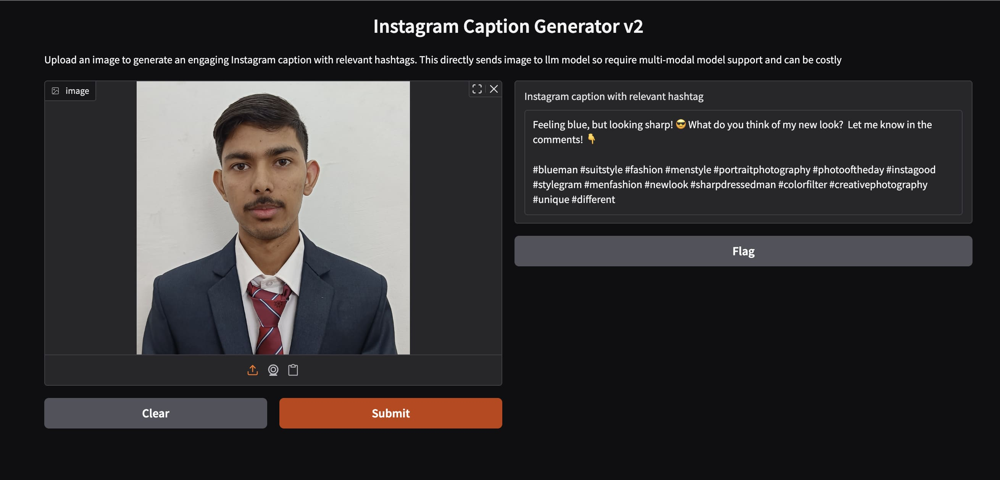

# Instagram Captioner AI

A tool that automatically generates compelling Instagram captions with relevant hashtags for your images.

## Overview

This project provides two different approaches to generate Instagram captions from images:

1. **Version 1 (Two-Stage Pipeline)**: First generates an image description locally using the BLIP model, then uses an LLM to create a caption based on that description.
2. **Version 2 (Direct Vision-Language Approach)**: Sends the image directly to a multimodal LLM (Gemini) to generate captions in a single step.

## Features

- Upload any image and get a professional Instagram caption
- Add relevant hashtags automatically
- Simple user interface built with Gradio
- Two different processing approaches to choose from based on your needs

## Tech Stack

- **Python 3.12**
- **Gradio**: For creating the web interface
- **Transformers**: Using Salesforce's BLIP model for image captioning
- **LiteLLM**: For unified access to various LLM APIs
- **Gemini 1.5 Flash**: Google's multimodal LLM for image understanding
- **OpenCV & PIL**: For image processing
- **PyTorch**: Backend for the BLIP transformer model
- **Python-dotenv**: For environment variable management

## Usage

### Setup

1. Clone this repository
2. Install dependencies:
`uv sync`
Or use the provided `pyproject.toml` with a tool like Poetry or PDM.

3. Create a `.env` file based on the provided `example.env` file.

### Running the Application

#### Version 1 (Two-Stage Approach)
This version:
- Generates image descriptions locally
- Sends text descriptions to LLM
- More cost-effective but potentially less accurate
- Shows both the image description and the final caption

```bash 
python app.py
```

#### Version 2 (Direct Vision-Language Approach)
This version:
- Sends images directly to a multimodal LLM
- More accurate but potentially higher API costs
- Only shows the final caption

```bash
python main.py
```

## How It Works

### Version 1



1. Uses the Salesforce BLIP model to generate a text description of the image
2. Sends this description to Gemini with a prompt to create an Instagram caption
3. Returns both the original description and the generated caption

### Version 2


1. Encodes the image to base64
2. Sends the image directly to Gemini with a prompt
3. Returns the generated caption

## Project Structure

- `src/caption.py`: Handles image captioning with the BLIP model
- `src/llm.py`: Contains functions for interacting with LLMs
- `src/ui.py`: UI implementation (development version)
- `app.py`: Main application entry point for Version 1
- `__main__.py`: Entry point for Version 2

## Requirements

See `pyproject.toml` for the complete list of dependencies.

## License

[Specify license here]

## Contributing

Contributions are welcome! Please feel free to submit a Pull Request.
